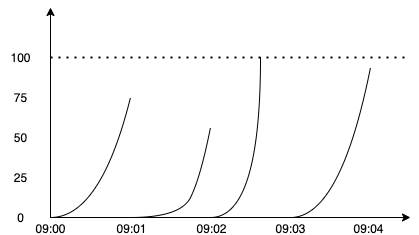

# 手把手教你在 Node.js 中使用 Redis 做请求限流

请求限流是一个用于控制网络请求与传输量的技术，在健全的 Node 应用中，我们通常会开启接口速率限制，来限定用户在一个周期时间内最大的请求数量，以此保护服务器免遭恶意请求与流量攻击。

在大规模的分布式应用中，我们通常可以通过网关层进行限流配置，但本文主要将的是如何在 Node 应用层去做限流，理解了其中的原理，就可以灵活地去应用各种限流的方法。

## 初始化工作

为了进行限流相关功能的探索，我们需要启动一个 Web 服务，在这里我带大家来使用优雅的 Koa 框架进行一些初始化的准备工作。

首先需要准备好 nvm，切换到 Node 14 的版本，因为接下来我会使用 ESM 的相关语法：

```bash
$ nvm use 14
$ mkdir limitexample && cd limitexample && npm init -y
$ vim package.json # add "type": "module" 
$ npm i koa ioredis koa-ratelimit
```

依赖安装完成后，接着来创建一个入口文件 `index.js` ：

```jsx
import Koa from "koa";
const app = new Koa();

// Put rate limit middleware

app.use(async (ctx) => (ctx.body = "Hello World"));
app.listen(3000);
```

通过 `nodemon index` 启动 Server 服务，由于文章接下来会使用到 Redis ，如果你还没有在本地安装 Redis 服务，可以使用 Docker 快速进行创建：

```bash
docker run --name redis-example -p 6379:6379 -e ALLOW_EMPTY_PASSWORD=yes -d redis
```

若要访问命令行客户段，则可通过 `docker exec -it redis-example redis-cli` 进行访问。

所有准备工作已做完，现在来开启 Coding & Test 旅程吧！

## 限流策略

### 固定窗口算法

固定窗口算法是一种计数器算法，固定窗口指的是一段固定的时间范围，窗口的大小即为允许通过的最大请求数，简而言之，固定窗口算法通过设定周期时间内最大允许的请求数目，来达到限流的效果。

它的核心逻辑为：在一个周期开始的时候，计数器清零，每个请求都将被计数，若计数达到上限，则不会再响应多余的请求，知道进入下一个周期。

我们来模拟一个使用固定窗口算法的网络请求图：



- 在 09:00 ~ 09:01 这段时间内，所产生的请求数是 75，并没有达到固定窗口的请求上限，然后进入到下一个周期 09:01 ~ 09:02 后，计数会重新清零。
- 在 09:02 ~ 09:03 期间，由于请求数很早就到达上限，在这段时间内超过上限的请求将不会相应并返回 429（Too Many Requests）。

我们使用 `用户ip:limitrate` 作为 Redis 的 Key，Key 的过期时间作为滑动窗口的大小，当请求进来时，进行以下两步判断：

- 若 Key 不存在，则设置当前 Key 的值为 1
- 若 Key 存在，则 Key 的值加 1

代码实现如下：

```jsx
// index.js
import { fixedWindow } from "./middleware/fixedWindow.js";
app.use(fixedWindow);

// middleware/ratelimit
import Redis from 'ioredis'

const FIX_WINDOW_SIZE = 60; // second
const FIX_WINDOW_MAX_REQUEST = 100;

const redisClient = new Redis(6379);

export const fixedWindow = async (ctx, next) => {
  const redisKey = `${ctx.ip}:ratelimit`;
  const curCount = await redisClient.get(redisKey);
  if (!curCount) {
    await redisClient.setex(redisKey, FIX_WINDOW_SIZE, 1);
    next();
    return;
  }
  if (Number(curCount) < FIX_WINDOW_MAX_REQUEST) {
    await redisClient.incr(redisKey);
    next();
  } else {
    ctx.status = 429;
    ctx.body = "you have too many requests";
  }
};
```

固定窗口算法是简单且易于实现的，但也有一个很明显的缺点，来看看下面的示意图：


在快要接近 09:03 的时候，请求数达到了 80 左右，到底  09:03 以后就被清零又重新计数，在这段相隔不到 1 分钟的时间内，实际请求数已经超过了设置的最大上限，因此这个算法的短板是很明显的，我们在下一个算法中看看如何进行改进。

### 滑动窗口算法

滑动窗口算法也是一种计数器算法，可将它看作固定窗口看法的改良版本，由上面的描述大家可以得知固定窗口算法在一个周期范围内只有一个窗口，在这个窗口内的请求会进行计数等操作，而滑动窗口则是在一个周期范围内同时具有多个窗口进行计数，我们可以将一个周期时间**拆分**为多个窗口，拆分的越细，滑动窗口算法越**平滑**。

为了统计当前滑动窗口的请求总数，就需要查询出所有时间范围在当前滑动窗口周期之内的窗口，然后将每个窗口的请求数进行累加，进行判断是否出发限流的条件，这就是滑动窗口算法，以下为示例图：


首先我们来定义滑动窗的模型所依赖的变量，通过模型我们可以计算出请求速率是否超过限制，大致需要定义以下信息：

- `DURATION` ，一段周期时间范围，单位秒
- `MAX_REQ_IN_DURATION` ，周期范围内所允许的最大请求数
- `SPLIT_DURATION` ，所拆分的最小窗口的时间周期，单位秒

为了限制用户在每 60 秒的时间内最多请求 100 次，我们可以定义以下的值：

```bash
const DURATION = 60
const MAX_REQ_IN_DURATION = 100
const SPLIT_DURATION = 1
```

除此之外，还需要一个数据结构用于储存用户的请求信息，在 Redis 中，使用 Hash 结构来计数是较为合适的，整个结构如下：


其中关于 Redis 结构，我们需要使用 ioredis 调用以下 Redis 命令完成相关操作：

- 在每次更新键值的时候，通过 `EXPIRE` 去更新 Redis Key 的过期时间
- 在每次更新键值的时候，通过 `HDEL` 删除在滑动窗口之前的 Hash Key
- 在每次更新键值的时候，我们需要通过 `HGETALL` 获取到所有 Key，然后进行进行判断：
    - 存在  Key 在最小拆分窗口的周期时间内，`HINCRBY` 在原有 Key 的基础上去增加 1
    - 不存在 Key 在最小拆分窗口的周期时间时，将当前时间的时间戳作为 `HINCRBY` 的 Key

逻辑讲的差不多了，接下来看代码吧：

```bash
// index.js
import { slidingWindow } from "./middleware/slidingWindow.js";
app.use(slidingWindow);

// middleware/slidingWindow
import Redis from "ioredis";

const DURATION = 60;
const MAX_REQ_IN_DURATION = 100;
const SPLIT_DURATION = 0.0001;
const redisClient = new Redis(6379);

export const slidingWindow = async (ctx, next) => {
  const redisKey = `ratelimit:${ctx.ip}`;
  const durationEnd = Date.now();
  const durationStart = durationEnd - DURATION * 1000;
  const splitStart = durationEnd - SPLIT_DURATION * 1000;
  const userRequestMap = await redisClient.hgetall(redisKey);
  if (Object.keys(userRequestMap).length === 0) {
    await redisClient
      .multi()
      .hset(redisKey, durationEnd, 1)
      .expire(redisKey, DURATION)
      .exec();
    next();
    return;
  }
  let requestCount = 0;
  let splitTimestamp = null;
  for (let [timestamp, count] of Object.entries(userRequestMap)) {
    if (Number(timestamp) < durationStart) {
      await redisClient.hdel(redisKey, timestamp);
    } else {
      requestCount += Number(count);
      if (Number(timestamp) > splitStart) {
        splitTimestamp = timestamp;
      }
    }
  }
  if (requestCount < MAX_REQ_IN_DURATION) {
    await redisClient.hincrby(redisKey, splitTimestamp ? splitTimestamp : durationEnd, 1);
    await redisClient.expire(redisKey, DURATION);
    next();
  } else {
    ctx.status = 429;
    ctx.body = "you have too many requests";
  }
};
```

### 滑动日志算法

滑动日志算法与滑动窗口算法很接近，唯一不同的是，滑动日志算法会记录下用户的每一个请求的时间戳，这种算法的计算方式更为准确，算法也更加简单，但是相比滑动窗口算法，会更加消耗内存。


滑动日志算法理解起来十分简单，想象我们有一个集合，用于储存每次请求的时间戳，在每一次请求到来时，查询集合中所有在时间周期内的时间戳数目即可，若请求数目没有超过最大限制，则将最新的时间戳存入集合；若超过最大限制，则返回429。

在 Redis 的数据结构中，Sorted set 是十分适合作为滑动日志算法的存储结构的，利用它的特性，我们可以能很容易实现一个高效的具备原子性操作的限流算法，使用命令如下：

- 每一个用户都有一个与之对应的 Sorted set 集合，在每一次请求
- 由于 Sorted set 之中的时间戳会过期，因此在进行所有操作之前，应该先使用 `ZREMRANGEBYSCORE` 清除过期的数据
- 使用 `ZCARD` 统计当前周期的请求数量
- 若请求数没达到限制，则通过 `ZADD` 添加时间戳，score 也设置为时间戳的值

 Redis 伪代码如下：

```bash
MULTI
ZREMRANGEBYSCORE {key} 0 {now - window_size}
ZADD {key} {now} {now}
ZCARD {key}
EXPIRE {key} {window_size}
EXEC
```

好了，现在来编码实现吧：

```bash
// index.js
import { slidingLog } from "./middleware/slidingLog.js";app.use(slidingWindow);
app.use(slidingLog);

// middleware/slidingLog
import Redis from "ioredis";

const DURATION = 60;
const MAX_REQ_IN_DURATION = 100;
const redisClient = new Redis(6379);

export const slidingLog = async (ctx, next) => {
  const redisKey = `ratelimit:${ctx.ip}`;
  const durationEnd = Date.now();
  const durationStart = durationEnd - DURATION * 1000;
  const exists = await redisClient.exists(redisKey);
  if (!exists) {
    await redisClient
      .multi()
      .zadd(redisKey, durationEnd, durationEnd)
      .expire(redisKey, DURATION)
      .exec();
    next();
    return;
  }
  const re = await redisClient
    .multi()
    .zremrangebyscore(redisKey, 0, durationStart)
    .zcard(redisKey)
    .expire(redisKey, DURATION)
    .exec();
  if (re[1][1] < MAX_REQ_IN_DURATION) {
    await redisClient.zadd(redisKey, durationEnd, durationEnd);
    next();
  } else {
    ctx.status = 429;
    ctx.body = "you have too many requests";
  }
};
```

### 漏桶算法

漏桶算法（Leaky Bucket）是一个经典的限速算法，我们可以将用户访问 API 接口的过程类比为往一个漏桶中加入水分，在这个过程中我们不会去限制水流入桶中的速度，而是限制水流出的速度，这样一来，当水流入速度超过流出的速度时，桶中的水平面就会不断上涨，直到填满整个桶以后，之后再有水流进入，就会溢出，示意图如下：


为了实现一个这样的算法，我们定义了以下变量：

- `rate` ，桶的流速，单位毫秒，桶内数量的流失速度
- `capacity` ，桶的容量

然后定义一下存储结构，这里的 Key 依然为用户的请求 IP，然后需要用 Redis Hash 结构储存两个变量：

- `last_update_time`，最近一次请求的时间
- `amount`，桶内当前请求数量

通过这两个变量即可计算出当前桶内的请求数量：`amount - (now - last_update_time) * rate`，若新的 `amount` 没有达到最大容量 ，则允许继续请求，否则就忽视掉请求。

为了节省内存，还需要为当前桶设置过期时间，过期时间可设置为 `amount * rate` 的秒级单位，代码如下：

```bash
// index.js
import { slidingLog } from "./middleware/slidingLog.js";
app.use(slidingLog);

// middleware/leakyBuckcet
import Redis from "ioredis";

const RATE = 1000;
const CAPACITY = 5;
const redisClient = new Redis(6379);

export const leakyBucket = async (ctx, next) => {
  const redisKey = `ratelimit:${ctx.ip}`;
  const now = Date.now();
  const exists = await redisClient.exists(redisKey);
  if (!exists) {
    await redisClient
      .multi()
      .hset(redisKey, "amount", 1)
      .hset(redisKey, "update_time", now)
      .expire(redisKey, RATE / 1000)
      .exec();
    next();
    return;
  }
  const updateTime = await redisClient.hget(redisKey, "update_time");
  const amount = await redisClient.hget(redisKey, "amount");
  const newAmount = Math.ceil(
    Math.max(0, amount - (now - updateTime) / RATE) + 1
  );

  if (newAmount <= CAPACITY) {
    await redisClient
      .multi()
      .hset(redisKey, "update_time", now)
      .hset(redisKey, "amount", newAmount)
      .expire(redisKey, (newAmount * RATE) / 1000)
      .exec();
    next();
  } else {
    ctx.status = 429;
    ctx.body = "you have too many requests";
  }
};
```

以上代码是使用漏桶算法实现的一个不考虑并发的模型，除此以外，在网络中，漏桶算法还可以作为一个先进先出队列（FIFO），控制端口的流量输出速率，实现流量整形，从而为网络提供一个稳定的流量。

### 令牌桶算法

令牌桶算法（Token Bucket）定义了一个集合（桶），集合只能容纳一定数量的令牌，当有请求访问服务时，都会去消耗一个令牌；若集合中没有令牌，则不允许请求通过，请求会排队或被丢弃。而令牌通通过一定速率去生成新的令牌，以此来达到限流的效果，它的模型如下：


相较于漏桶算法，漏桶算法的请求流出出口的速率由于是恒定的，所以它没办法应对短时间的突发请求，但是在令牌算法里，我们只需要控制令牌的生成速率，即可应对各种情况的变化。

针对令牌桶算法，我们的实现逻辑可以借鉴漏桶算法，只需要将部分流程反过来即可，在数据结构结构上遵从之前定义出来的漏桶算法的结构，使用 Hash 储存用户当前的令牌数与更新时间，在下一次请求来的时候，再通过更新时间与令牌生成速率去生成新的令牌。

大致代码步骤如下：

1. 当请求进来时，初始化一个令牌桶与过期时间，其中每次进行更新操作，都需要设置令牌桶的过期时间为需要补充的令牌数
2. 计算当前最新的令牌数为多少，判断是否请求能拿到令牌：
    1. 若请求能拿到令牌，则更新最新的令牌数与更新时间
    2. 若不能拿到令牌，将该请求抛弃

下面来看看代码吧：

```bash
// index.js
import { tokenBucket } from "./middleware/tokenBucket.js";
app.use(slidingLog);

// middleware/leakyBuckcet
import Redis from "ioredis";

const RATE = 1000;
const CAPACITY = 5;
const redisClient = new Redis(6379);

export const tokenBucket = async (ctx, next) => {
  const redisKey = `ratelimit:${ctx.ip}`;
  const now = Date.now();
  const exists = await redisClient.exists(redisKey);
  if (!exists) {
    await redisClient
      .multi()
      .hset(redisKey, "amount", CAPACITY - 1)
      .hset(redisKey, "update_time", now)
      .expire(redisKey, RATE / 1000)
      .exec();
    next();
    return;
  }
  const updateTime = await redisClient.hget(redisKey, "update_time");
  const amount = await redisClient.hget(redisKey, "amount");
  const newAmount =
    Math.min(CAPACITY, Number(amount) + Math.floor((now - updateTime) / RATE)) -
    1;

  if (newAmount >= 0) {
    await redisClient
      .multi()
      .hset(redisKey, "update_time", now)
      .hset(redisKey, "amount", newAmount)
      .expire(redisKey, ((CAPACITY - newAmount) * RATE) / 1000)
      .exec();
    next();
  } else {
    ctx.status = 429;
    ctx.body = "you have too many requests";
  }
};
```

## 生产与使用

上述算法主要结合 Node 与 Redis 实现了特定模式下的基本功能，并不建议将其直接投入生产使用，而是应该基于基本的思想，完成并发原子性测试，还有性能测试，以上代码仅供学习参考，完整代码仓库在[这里](https://github.com/vv13/rate-limit-example)，另外向大家推荐几个其他方法。

### koa-ratelimit

使用受欢迎的第三方库，总比自己写的限流算法要稳定一些，在这里可以使用 `koa-ratelimit` 中间件进行测试，它支持内存模式或 Redis 模式：

```jsx

// index.js
import { koaRateLimit } from "./middleware/koaratelimit.js";
app.use(koaRateLimit)

// middleware/koaratelimit.js
import ratelimit from "koa-ratelimit";

export const koaRateLimit = ratelimit({
  driver: "memory",
  db: new Map(),
  duration: 60 * 1000,
  errorMessage: "Sometimes You Just Have to Slow Down.",
  id: (ctx) => ctx.ip,
  headers: {
    remaining: "Rate-Limit-Remaining",
    reset: "Rate-Limit-Reset",
    total: "Rate-Limit-Total",
  },
  max: 100,
  disableHeader: false,
});
```

### redis-cell

redis-cell 是一个用于速率限制的三方模块，该模块公开了一个 `CL.THROTTLE` 命令作为单条的原子命令进行速率限制等设置，具体使用规则请见[这篇文章](https://redislabs.com/blog/redis-cell-rate-limiting-redis-module/)。

### nginx 限流

Nginx官方版本限制IP的连接和并发分别有两个模块：

- limit_req_zone 用来限制单位时间内的请求数，即速率限制,采用的漏桶算法 "leaky bucket"。
- limit_req_conn 用来限制同一时间连接数，即并发限制。

## 参考

- [System Design: Sliding window based Rate Limiter](https://www.codementor.io/@arpitbhayani/system-design-sliding-window-based-rate-limiter-157x7sburi)
- [Understanding and implementing rate limiting in Node.js](https://blog.logrocket.com/rate-limiting-node-js/)
- [https://github.com/koajs/ratelimit](https://github.com/koajs/ratelimit)
